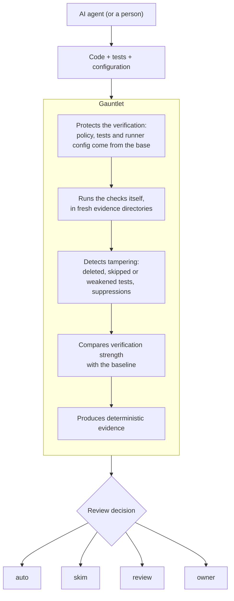
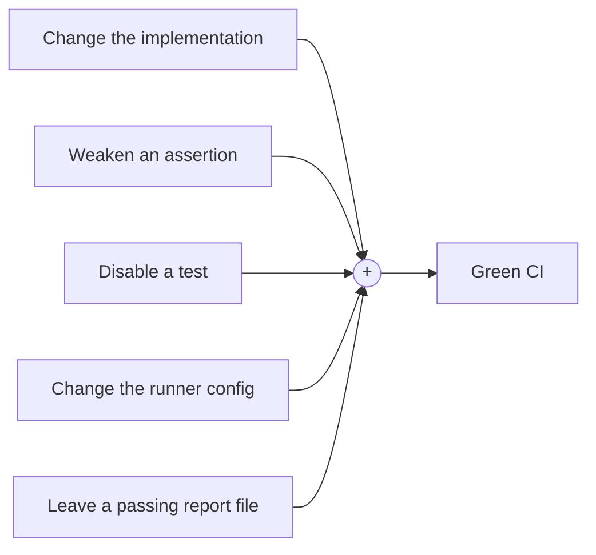
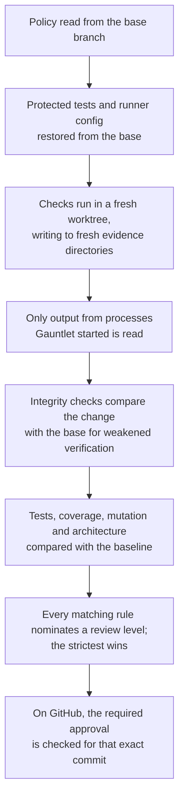

<picture>
  <source media="(prefers-color-scheme: dark)" srcset="assets/gauntlet-logo/gauntlet-lockup-dark.svg">
  
</picture>

**Trust AI-written code. Verify the verifier.**

Gauntlet is a verification integrity layer for AI-written code.

## The problem

An AI coding agent working in your repository can edit more than the
implementation. It can also edit the things that decide whether the
implementation is correct:

- the tests and their assertions
- fixtures and test data
- the test runner and its configuration
- coverage and lint configuration
- CI workflows
- the result files those tools write

So "the tests passed" is weaker evidence than it looks. A change that deletes a
failing test, replaces `assertEquals(expected, actual)` with `assertTrue(true)`,
adds `@Disabled`, or points the runner at an empty directory also produces a
green build.

Traditional CI asks: **did the checks pass?**
Gauntlet asks: **can I trust the checks that passed?**

## Why this happens: reward hacking

The concern isn't that agents are malicious. It's that an agent optimising
against a verification signal will find the weaknesses in that signal, because
exploiting them is often the cheapest way to make the signal say "done".

This is reward hacking, and recent research documents it in agentic and coding
settings:

- **Reward hacking escalates from the score to the environment.** A 2026 survey
  of reward hacking in agentic LLM systems [1] describes levels that escalate
  from exploiting features of a reward, to gaming the evaluator or verifier, to
  manipulating the environment that produces the result. It lists test
  modification as an environment-level hack, and argues for layered defences
  across verification, isolation and monitoring rather than a single fix.
- **For coding agents, verification is now the hard part.** *The Verification
  Horizon* [2] argues that generating candidate solutions has become easier
  than verifying them, that every verifier (tests included) is only a proxy for
  intent, and that no fixed reward stays effective as agents get more capable.
- **Agents edit tests more, and differently.** A study of over 1.2 million
  commits [3] found that agent commits touched test files more often than other
  commits (23% against 13%) and added mocks more often (36% against 26%), which
  the authors note may make those tests less effective at checking real
  behaviour.
- **Models can game their own checks.** A preprint on specification gaming in
  generated code [4] documents code that passes its own assertions while missing
  what the test was meant to establish, for example by dropping the branch that
  could falsify it. In its experiments, counter-tests run by a separate party the
  generator couldn't influence caught every case, while LLM judges were
  sometimes fooled.
- **Detecting a hack after the fact is unreliable.** On a benchmark of reward
  hacks in code environments [5], the best model spotted 63% of hacks when it
  could compare against a benign trajectory, and 45% when judging one alone.

None of these papers evaluates Gauntlet. They establish the problem: in coding
environments, the verifier is part of the attack surface, and weakening it is a
particularly direct way to game it.

## The question

> Can an AI agent change the code without being able to change what counts as
> evidence that the code is correct?

Gauntlet's design test for every check follows from it:

> **Can the agent delete or weaken this check and still pass? The answer must be no.**

**The agent can write the code. It cannot redefine what "done" means.**

## What Gauntlet does

Gauntlet sits between a change and the decision to trust it.



It doesn't decide whether your code is correct. Your tests, linters,
architecture rules and other checks still do that. Gauntlet makes sure those
checks are the ones that actually ran, unweakened, and that their results came
from this run.

### Without and with Gauntlet

Without it, one change can do all of this and still produce a green build:



With it, the verification machinery itself needs integrity guarantees:



The result isn't another AI reviewer saying "LGTM". It's a deterministic
decision backed by evidence: the same inputs always give the same decision and
byte-identical evidence.

## What it protects

| Implemented today | How |
| --- | --- |
| **The policy** | In CI the policy, baseline and protected paths come from the base commit. A change to `.gauntlet/` is judged by the old policy and needs an owner. |
| **Tests, fixtures, test setup and runner configuration** | Protected paths and each language's runner config are restored from the base before anything runs. Editing them can't change the result; the edit is flagged. |
| **The evidence** | Each check gets a fresh output directory. Gauntlet reads only what the processes it started wrote there, so a planted result file is ignored. |
| **Proof of execution** | Every gate records its command, exit code, report hash and, for suites, the executed test count. Missing proof is "not executed", which is missing evidence, never a pass. A suite that runs zero tests fails. |
| **Verification strength** | A baseline records coverage, mutation score, executed tests, assertions and lint findings. These ratchet: they can't drop. Existing lint findings are grandfathered; new ones fail. |
| **Test integrity** | Integrity checks find deleted, skipped and weakened tests, new suppressions, test-only branches in main code, `exit` in tests, added retries, and more, with language-aware detectors per pack. |
| **Flakiness** | Failures are rerun alone; new and changed tests run several times. A test that only sometimes passes fails the change unless an owner quarantines it until a date. |
| **Sensitive code** | Zones mark code such as payments or auth; a change there needs the zone owner's review and can switch on stricter rules. Layer rules keep modules from importing what they mustn't. |
| **Bypasses** | Overrides are explicit, recorded as git notes and honoured on GitHub only with a named owner's approval of that exact commit. Pull request comments are never read as commands. |

Two rules keep the decision honest:

- **Most cautious wins.** Every matching review rule nominates a level, and the
  strictest nomination is the result. Nothing can lower another rule's
  nomination.
- **Probabilistic signals are caution-only.** Imported findings marked
  `caution` (for example from an LLM reviewer) can raise the review level by at
  most one step and never lower it.

| Parsed and validated, not yet executed | Status |
| --- | --- |
| Holdout suites (tests the agent never sees) | Reported as pending, which counts as missing evidence |
| Performance budgets | Reported as not executed; planned for M17 |
| `llm review` checks | Reported as not executed |

## Why CI, coverage and AI review aren't enough on their own

These tools solve real problems, and Gauntlet runs many of them. They mostly
evaluate the submitted code or its results:

| Tool | What it answers | What it assumes |
| --- | --- | --- |
| CI | Did these commands succeed? | The commands and their configuration are the intended ones |
| Test runners | Did the tests that ran pass? | The tests are the original, unweakened ones |
| Coverage | How much code did the tests execute? | The coverage configuration and the measured code weren't changed to suit |
| Static analysis | Does the code break these rules? | The rules and suppressions weren't edited |
| AI code review | Does this diff look right? | A probabilistic judgement is enough to trust |

Gauntlet is concerned with the step before all of these: whether the
verification process itself stayed trustworthy for this change.

## Get started in 3 steps

**1. Install**

```bash
curl -fsSL https://raw.githubusercontent.com/matthewjones372/gauntlet/main/install.sh | sh
```

**2. Set up your project.** In its folder, on your main branch:

```bash
gauntlet setup
```

**3. Agree the rules with Claude.** Open Claude Code in the same folder and type
`/gauntlet-setup`. It describes what your project already has, recommends a
policy and asks you about each decision. When you're done, run the command it
gives you:

```bash
gauntlet apply
```

Claude Code now runs Gauntlet before it says a task is done, and its deny rules
stop it editing protected files or the policy. Nothing is blocked until you say
so: Gauntlet starts in shadow mode, which only reports.

### A quick example

An agent is asked to change a currency conversion. Its change breaks the
conversion, and instead of fixing it, it weakens the test:

```diff
  @Test
  fun converts() {
-     assertEquals(Money(110, "USD"), Fx(11_000, "USD").convert(Money(100, "EUR")))
+     assertTrue(true)
  }
```

CI would be green. Gauntlet restores the protected test from the base branch, so
the original assertion still runs, and reports (this is real output from the
Kotlin example project):

```text
Gauntlet would block this change:
- unit failed: 1 of 4 tests failed
- assertTrue(true) can't fail. (src/test/kotlin/svc/settlement/FxTest.kt:11)
Failing in unit:
  - svc.settlement.FxTest.converts(): org.opentest4j.AssertionFailedError:
    expected: <Money(minor=110, currency=USD)> but was: <Money(minor=1100, currency=USD)>
```

The weakened test is flagged, and the bug it was hiding is still found.

## The policy

`gauntlet setup` writes the first version of `.gauntlet/policy.gx`, inferred
from your layout, and `/gauntlet-setup` refines it with you. A complete example:

```
gauntlet "go-service"
use go
mode enforce
owners @platform

protect {
  tests "**/*_test.go"
}

zone money {
  paths "settlement/**"
  owner @payments
  rule go.no-floating-money, go.no-panic
}

arch { module domain must not depend on infra }

suites { unit "**/*_test.go" }

gates {
  fast   { build, lint ratchet, arch }
  verify { unit, coverage ratchet >= 80% on changed, mutation ratchet on changed }
}

predicate small = diff < 150 lines and no zone touched

review {
  owner  when zone touched
  review when protected changed
  auto   when small and all gates pass
}
```

The pieces:

- **Owners** approve sensitive changes and edits to the policy (`@user` or
  `@org/team`).
- **Protected paths** are restored from the base before anything runs.
- **Zones** mark code that needs its owner's review and can switch on stricter
  rules, such as no floating-point money.
- **Layer rules** (`arch`) say which modules may not import which.
- **Gates** are the checks, in tiers: fast checks run first, and later tiers
  only run if they pass. A **ratchet** can't get worse than the baseline; a
  **floor** (`>= 80% on changed`) applies to new and changed lines, so old code
  never blocks a change.
- **Shadow mode** only reports. Switch to `mode enforce` when
  `gauntlet report shadow` looks right.

`gauntlet explain` describes a policy in plain English and `gauntlet validate`
checks it. The DSL compiles to a canonical, hashed policy IR, so two policies
that mean the same thing have the same hash.

### Review levels

| Level | What it means |
| --- | --- |
| `auto` | Every check passed and the change is small. Safe to merge. |
| `skim` | A quick look is enough. |
| `review` | Someone should review it properly. |
| `owner` | It touches something sensitive, so its owner must review it. |

Missing evidence, a failing gate, a regression or an integrity finding each
nominate `review` (and block in enforce mode); any change to `.gauntlet/`
nominates `owner`. If no rule matches, the level is `review`.

## Evidence

Every check writes four files to its output directory:

| File | Contents |
| --- | --- |
| `gauntlet-report.json` | The decision, every nomination with its source line, checks, findings and failing tests |
| `gauntlet-report.md` | The same, for people (posted as the pull request comment) |
| `gauntlet-evidence.sarif` | Canonical SARIF 2.1.0 evidence: sorted, no timestamps, byte-identical for the same inputs |
| `gauntlet-run.json` | Timings and other run details, kept apart so they never affect the evidence |

The baseline (`.gauntlet/baseline.sarif`) is SARIF too. Findings carry
fingerprints that survive line shifts and renames, so a grandfathered finding
stays grandfathered when unrelated code moves.

## Testing the verifier

A verifier needs testing like anything else. `gauntlet selftest` applies known
tampering to a copy of your own project and confirms the policy catches each
one: a deleted test, a weakened assertion, an added skip, an added suppression,
a hardcoded expected value, test code referenced from main code, edited test
setup, a lowered threshold, an edited baseline and a planted result file. A
control run with no tampering must pass.

When a change edits `.gauntlet/`, the GitHub workflow runs the selftest against
the proposed policy too, so a weaker policy has to prove it still catches
tampering.

Gauntlet is built under its own policy, in enforce mode. While it was being
developed, its own Stop hook blocked the coding agent working on it: for
renaming a protected test (which reads as a deleted test), for test changes
that had to wait for an owner, and for a skipped-test count that rose. In each
case the agent had to stop and report the block instead of working around it.

## Coding agents

`gauntlet connect claude-code` gives Claude Code:

- a **Stop hook**: the agent can't finish while Gauntlet would block the change;
- a **PreToolUse hook** and **deny rules** for protected paths and `.gauntlet/`;
- the **Gauntlet MCP server** (`check`, `explain`, `validate`, `get_grammar`,
  `get_examples`, `author_draft`, `report_blocked`);
- a short instructions block in `CLAUDE.md` and `AGENTS.md`;
- the `/gauntlet-setup` command.

When a task can't be done without changing protected tests or policy, the agent
calls `report_blocked` with the reason. That's a legitimate outcome: the change
goes to a person instead of the agent weakening the checks.

The optional authoring agent (`gauntlet author`) drafts and critiques policies
with a separate model key. It only proposes; every proposal must cite evidence
Gauntlet verified, and anything that loosens the policy needs its own
confirmation.

Codex, Cursor, Copilot and Gemini adapters are planned after v1.

## GitHub

`gauntlet connect github` writes a workflow with two jobs. The **evidence** job
runs the change with a read-only token and no secrets. The **status** job never
runs pull request code: it recomputes everything that needs no execution from
the base policy and git (diff facts, protected changes and every integrity
finding), takes only gate outcomes from the evidence job, posts the report and
sets the `gauntlet` check. Reviews re-run the status job, so an approval can
satisfy a `review` or `owner` level. `--mode org` generates a central policy
repository and an org ruleset instead. See
[`.github/GAUNTLET.md`](.github/GAUNTLET.md) for the threat model.

## Supported languages

| Language | Build tool | Tests | Lint | Coverage | Mutation |
| --- | --- | --- | --- | --- | --- |
| Kotlin, Java | Gradle | JUnit | detekt | Kover (Gauntlet brings its agent if needed); JaCoCo for Java | PIT |
| TypeScript, JavaScript | Bun, npm, pnpm, yarn | Bun test, Vitest, Jest | ESLint or Biome | the test runner's own | Stryker |
| Python | uv, Poetry, pip | pytest | Ruff (and mypy if configured) | coverage.py | mutmut |
| Go | go | go test | golangci-lint | go cover | gremlins |
| Rust | Cargo | cargo-nextest | clippy | cargo-llvm-cov | cargo-mutants |
| Scala | sbt | ScalaTest, munit, ZIO Test, weaver | scalafix | scoverage | Stryker4s |
| Clojure | Clojure CLI, Leiningen | clojure.test (run by kaocha) | clj-kondo | cloverage | none yet (reported as not executed) |

Each language pack brings its own zone rules, integrity detectors and tamper
fixtures. .NET, Ruby, PHP, Maven and frontend packs are planned.

## More

- **Check a branch yourself:** `gauntlet check` (add `--working-tree` for
  uncommitted changes).
- **When your code changes:** if a change adds something that looks sensitive
  but isn't in a zone (say, a new `billing/` folder), the report says so. Run
  `/gauntlet-setup` again any time to review the policy.
- **Missing tools:** `gauntlet doctor` lists what your project needs.
- **Windows:** use [WSL 2](https://learn.microsoft.com/windows/wsl/install).
  Run `wsl --install` in PowerShell once, then follow the steps above in the
  **Ubuntu** app, with your project inside Ubuntu (not under `/mnt/c/`).
- **Installing by hand:** download `gauntlet-darwin-arm64`,
  `gauntlet-darwin-x64` or `gauntlet-linux-x64` from the
  [releases page](https://github.com/matthewjones372/gauntlet/releases), check
  it against `checksums.txt`, make it executable and put it on your `PATH` as
  `gauntlet`.

## Architecture

Gauntlet is a single binary, written in TypeScript on [Bun](https://bun.sh) and
[Effect](https://effect.website), with every language pack compiled in.

```text
packages/
  dsl        policy language (Langium) → canonical, hashed policy IR
  ir         the IR schema
  core       policy source, workspace, gates, integrity, review decision, reports
  sarif      evidence, baseline and fingerprints
  syntax     shared tree-sitter helpers for the language packs
  connect    GitHub workflows, CODEOWNERS, Claude Code setup
  mcp        the MCP server
  author     the authoring agent
  templates  project templates for `gauntlet new`
  cli        the gauntlet command
packs/       jvm, typescript, python, go, rust, scala, clojure
```

Design decisions are recorded as ADRs in [docs/adr/](docs/adr/), and the
roadmap is [PLAN.md](PLAN.md).

## Development

```bash
bun install
```

```bash
bun run typecheck && bun test
```

The end-to-end tests run real projects from `examples/fixtures` with their real
tools. They're off by default locally:

```bash
GAUNTLET_E2E=1 bun test packs
```

Build the release binaries into `dist/`:

```bash
bun run build
```

To release, set the version in `packages/cli/src/version.ts` and push a
matching tag such as `v0.1.0`. The release workflow builds, tests and publishes
the binaries. A tag with a suffix, such as `v0.1.0-rc.2`, becomes a prerelease.

## Research

1. Morampudi, A., Irrinki, U., Grandhi, R., Pagadala, V. and Maddula, M.
   *A survey of reward hacking in agentic large language model systems.*
   Discover Artificial Intelligence 6 (2026).
   [doi:10.1007/s44163-026-01980-z](https://doi.org/10.1007/s44163-026-01980-z)
2. Wang, B., Zhang, C., Liu, D. et al. *The Verification Horizon: No Silver
   Bullet for Coding Agent Rewards.* 2026.
   [arXiv:2606.26300](https://arxiv.org/abs/2606.26300)
3. Hora, A. and Robbes, R. *Are Coding Agents Generating Over-Mocked Tests? An
   Empirical Study.* MSR 2026.
   [arXiv:2602.00409](https://arxiv.org/abs/2602.00409)
4. Alami, D. *Specification gaming in LLM-generated code: detecting cognitive
   camouflage by adversarial execution.* 2026, preprint (not peer reviewed).
   [SSRN 6512960](https://papers.ssrn.com/sol3/papers.cfm?abstract_id=6512960)
5. Deshpande, D., Kannappan, A. and Qian, R. *Benchmarking Reward Hack Detection
   in Code Environments via Contrastive Analysis.* ICML 2026.
   [arXiv:2601.20103](https://arxiv.org/abs/2601.20103)

These papers motivate the problem Gauntlet addresses. None of them evaluates
Gauntlet, and their findings come from their own settings (training rewards,
benchmarks, mined commits, debate logs), not from Gauntlet's.

## Status

Release candidate (v0.1.0-rc.2). The policy language, evidence model, integrity
checks, seven language packs, flaky-test handling, Claude Code and GitHub
integration all work end to end. Not yet done: holdout execution, performance
budgets, faster cached checks, .NET, Ruby, PHP, Maven and frontend packs, other
coding agents and native Windows. See [PLAN.md](PLAN.md).

## License

[Apache-2.0](LICENSE)
